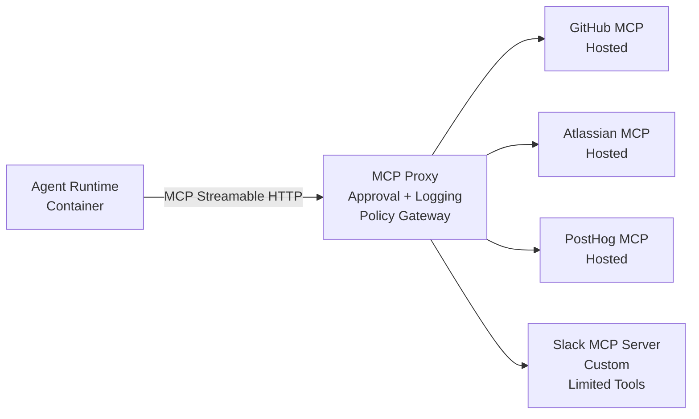

# Thor — AI Team Member Architecture

> **Scope**: Thor is an AI team member for the Acme team — covering both product and engineering responsibilities to help human members deliver work faster. It is **not** an extension of Acme's production architecture (EKS, Mastra, AG-UI). Alignment with production infrastructure is welcome but not required.

## Core Topology



---

# Integration Strategy

| Integration | Approach          | Auth (MVP)       | Endpoint                             | Notes             |
| ----------- | ----------------- | ---------------- | ------------------------------------ | ----------------- |
| GitHub      | Hosted MCP        | Fine-grained PAT | `https://api.githubcopilot.com/mcp/` | Repository scoped |
| Atlassian   | Hosted MCP        | Basic Auth       | `https://mcp.atlassian.com/v1/mcp`   | Team scoped       |
| PostHog     | Hosted MCP        | API Key          | `https://mcp.posthog.com/mcp`        | Project scoped    |
| Slack       | Custom MCP Server | Slack Bot Token  | Internal container                   | Limited tools     |

**GitHub** — Fine-grained PAT, repository scoped. Permissions: Contents (read), Pull requests (write), Issues (write), Actions (read). Write operations require approval.

**Atlassian** — Basic Auth (scoped API token), team scoped. Read/create/comment/update Jira issues, Confluence pages, and JSM alerts. Write operations may require approval.

**PostHog** — API Key, pinned to organization + project. Read-only queries and error investigation. Mutations (feature flags, experiments) require approval.

**Slack** — Bot Token, workspace scoped. Custom MCP server restricts posting to predefined channels. Also serves as the approval notification channel for the policy proxy.

---

# Policy Proxy

The proxy is an MCP server toward Thor and an MCP client toward downstream integrations. It enforces policy, logs all tool activity, and manages approval workflows.

Each tool call is evaluated as one of:

- **Allow** — forwarded immediately
- **Block** — rejected with a policy message
- **Approval Required** — stored in a queue, Thor receives an action ID with pending status and is **not blocked**

For approval, the proxy sends a Slack notification via the Slack MCP server. Once resolved, the proxy executes or discards the request. Thor will be notified once approved/rejected. In rare cases, Thor can choose to poll the action ID and wait for the outcome.

Approval is typically required for: PR creation, issue modifications, Jira status updates, PostHog config changes, etc.

---

# Triggers

Thor is event-driven, not continuously running. All triggers flow into a **shared event bus** as structured events. The agent-runner consumes events and manages lifecycle. New trigger sources can be added by emitting events into the bus — no changes to Thor or the proxy required.

Initial trigger sources:

- **Slack mention** — user @mentions Thor in a thread
- **Scheduled job** — cron tasks (e.g. PostHog error check every 6h)
- **Approval resolution** — emits back into the originating session
- **Webhook event** — external systems like Jira

---

# Sessions

A **session** groups related events by correlation key:

| Source   | Correlation Key            | Example                            |
| -------- | -------------------------- | ---------------------------------- |
| Slack    | Thread ID                  | `slack:thread:1234567890.123`      |
| Jira     | Issue ID                   | `jira:issue:ABC-123`               |
| Cron     | Job name + schedule window | `cron:posthog-check:2026-03-08T06` |
| Approval | Originating session ID     | (inherits)                         |

### Lifecycle

```
idle → collecting → running → cooldown → idle
```

**Collecting** — First event starts a debounce window. Subsequent events with the same key extend it. On close, events merge into a single agent prompt.

| Source   | Debounce  |
| -------- | --------- |
| Slack    | ~5 sec    |
| Jira     | ~2 sec    |
| Approval | immediate |
| Cron     | immediate |

**Running** — One agent run per session at a time. New events are queued.

**Cooldown** — If events queued during the run, a new collecting phase starts. Otherwise returns to idle.

### Event Merging

Batched events are merged into a single prompt. Slack: multiple thread messages become one context block. Jira: multiple webhook payloads become one change description.

### Memory

Three layers:

**Session continuity** — The agent-runner maps correlation keys to agent runtime session IDs, resuming existing sessions on new events.

**Working files** — Date-organized persistent files:

```
worklog/
└─ 2026/03/08/
   ├─ slack-abc-123.md
   ├─ jira-ACME-456.md
   └─ posthog-check-06h.md
```

The agent-runner seeds each file with trigger context. Follow-up events append. Thor can update these files freely during a run.

**Project knowledge** — The existing `docs/` directory and source code. Over time, worklog entries can be consolidated into `docs/`.

---

# Security

- **Least privilege** — each component only holds the credentials it needs. Thor has no direct access to external APIs.
- **Tool allowlisting** — the proxy controls which tools are exposed.
- **Scoped credentials** — tokens pinned to specific repos, teams, or projects.
- **Approval for writes** — mutating actions require human approval.
- **Audit logging** — all tool invocations, policy decisions, and outcomes recorded centrally.

---

# Scenarios

Three examples of how Thor contributes across product and engineering work.

### PR merges, errors spike 20 minutes later

A scheduled job queries PostHog and notices a 40% error rate increase on `/api/execute`. Thor checks GitHub for recent merges, finds PR #1047 landed 20 minutes before the spike, and reads the diff. A changed import path matches the error stack trace. It drafts a one-line fix — the policy proxy holds the PR for approval and pings Slack. An engineer approves, the draft PR appears, and Thor posts a summary linking the PR, the PostHog chart, and the original merge.

### Bug filed in Jira, Thor prepares context

A new bug is filed in Jira. The webhook triggers Thor. It reads the issue description, searches the codebase for relevant files, checks git blame for recent changes in that area, and pulls related PostHog session data. It comments on the Jira issue with a summary: likely affected files, recent commits, and who last touched the code. No fix attempted — just triage prep that saves 15 minutes of context-gathering.

### Daily codebase health digest

A daily cron job has Thor review open PRs older than 5 days, Jira issues marked "in progress" with no linked PR, and CI runs with increasing flakiness. It posts a morning summary to Slack: "3 stale PRs, 2 issues with no linked code, `auth.test.ts` has failed 4 of the last 10 runs." This is the product side of its role — tracking delivery health so the team can act on it.

---

# Appendix: Agent Runtime Candidates

|                         | Mastra                         | OpenClaw                              | OpenCode                          |
| ----------------------- | ------------------------------ | ------------------------------------- | --------------------------------- |
| Integration plumbing    | Low (already in use)           | Low (native skills)                   | Medium (MCP-native, needs runner) |
| Security hardening      | Low (familiar surface)         | High (CVEs, hardening)                | Low (headless, minimal surface)   |
| Session / orchestration | Medium (workflow engine helps) | Medium (own model conflicts)          | High (nothing built-in)           |
| Coding capability       | Weakest for freeform code      | General-purpose, no native code tools | Strongest (purpose-built)         |

## Mastra

[Mastra](https://mastra.ai/) ([GitHub](https://github.com/mastra-ai/mastra)) — Already used in Acme's production agent (`acme-agent` package). TypeScript. `@mastra/core` 1.8.0 (forked as `@acme/mastra-core`).

**Pros**: Team already knows the framework — same agent/tool/workflow patterns used in production. Built-in MCP client (`@mastra/mcp`) already proven with Playwright MCP in the codebase. Native tool system with Zod schemas, streaming, and agents-as-tools. Postgres-backed memory and storage via `@mastra/pg`. Observability built in (Langfuse, OTEL). Hono server with custom API routes — natural fit for webhook ingestion and the event bus. Workflow engine (`createWorkflow`, `createStep`) can model session lifecycle and multi-step investigation. No new dependency to learn or evaluate.

**Cons**: Mastra is designed for request-response agent runs, not long-lived event-driven sessions — the trigger/debounce/cooldown lifecycle still needs a custom agent-runner layer on top. No built-in approval queue or policy proxy — must be built as a custom MCP server or middleware. The fork (`@acme/mastra-core`) adds maintenance burden and may drift from upstream. Heavier runtime than a standalone coding agent — more suited to structured tool orchestration than freeform code editing (reading files, writing diffs, running tests). Production Mastra runs on EKS — this internal tool targets a lighter deployment (Railway), so infra reuse is limited.

## OpenClaw

[OpenClaw](https://openclaw.ai/) ([GitHub](https://github.com/openclaw/openclaw)) — AGPL-3.0, 68k+ stars, TypeScript. Formerly Clawdbot/Moltbot. Model-agnostic (Claude, GPT, DeepSeek, Kimi).

**Pros**: Native MCP client (JSON-RPC 2.0 over stdio/HTTP). 13,700+ community skills covering GitHub, Jira, PostHog, Slack. Persistent memory (daily + long-term) reduces memory-layer build effort. Messaging-first design — Slack triggers work out of the box. Heartbeat loop supports cron-like scheduled tasks without external scheduler. Skill system (markdown + TypeScript) is lightweight for custom workflows. Model-agnostic — swap LLM providers without code changes.

**Cons**: Serious security track record — CVE-2026-25253 (critical RCE), 824+ malicious skills found in registry, 30,000+ exposed instances discovered without auth. Enterprise readiness rated 1.2/5. Auth disabled by default; hardening requires gateway tokens, firewall, TLS proxy, secrets manager, and disabled public skill registry. General-purpose personal assistant, not a purpose-built coding agent — coding quality depends on skill prompts and underlying LLM. Own session/memory model conflicts with the proposal's lifecycle (idle → collecting → running → cooldown); an external agent-runner is still needed for debounce and correlation. Policy proxy routing requires redirecting all MCP connections through config — workable but fights the default direct-connect architecture. Fast-moving release cycle with rocky security history demands ongoing maintenance.

## OpenCode

[OpenCode](https://opencode.ai/) ([GitHub](https://github.com/sst/opencode)) — MIT, 118k stars, TypeScript, v1.2.21 (March 2026). Multi-provider (75+ models).

**Pros**: Remote MCP client with OAuth. Headless server (`opencode serve` with OpenAPI). Programmatic invocation (`opencode run --format json`). Session resumption. Customizable agents with granular tool permissions. [Docker images](https://github.com/FelixClements/opencode-server-docker) available. MIT — fully forkable, no vendor lock-in.

**Cons**: No built-in event bus or session correlation — trigger/debounce lifecycle needs an external agent-runner. Async approval (action ID polling) must be taught via system prompt. Proposal's worklog memory model needs custom implementation. API surface may shift across releases.
